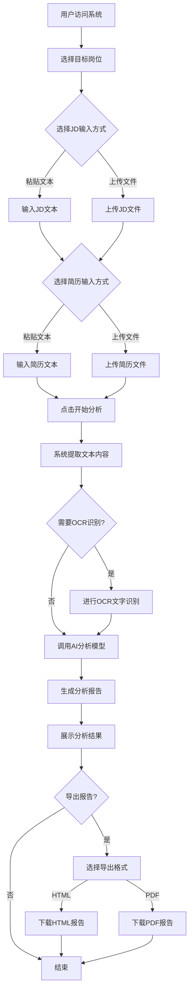
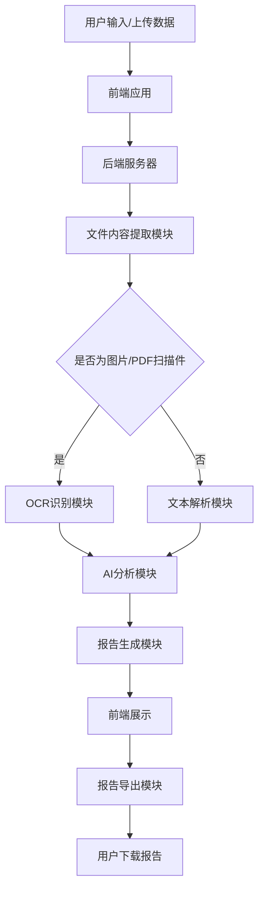
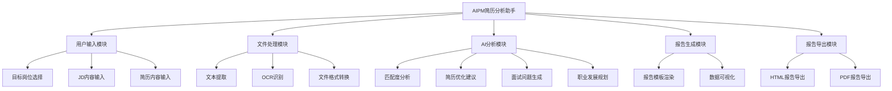
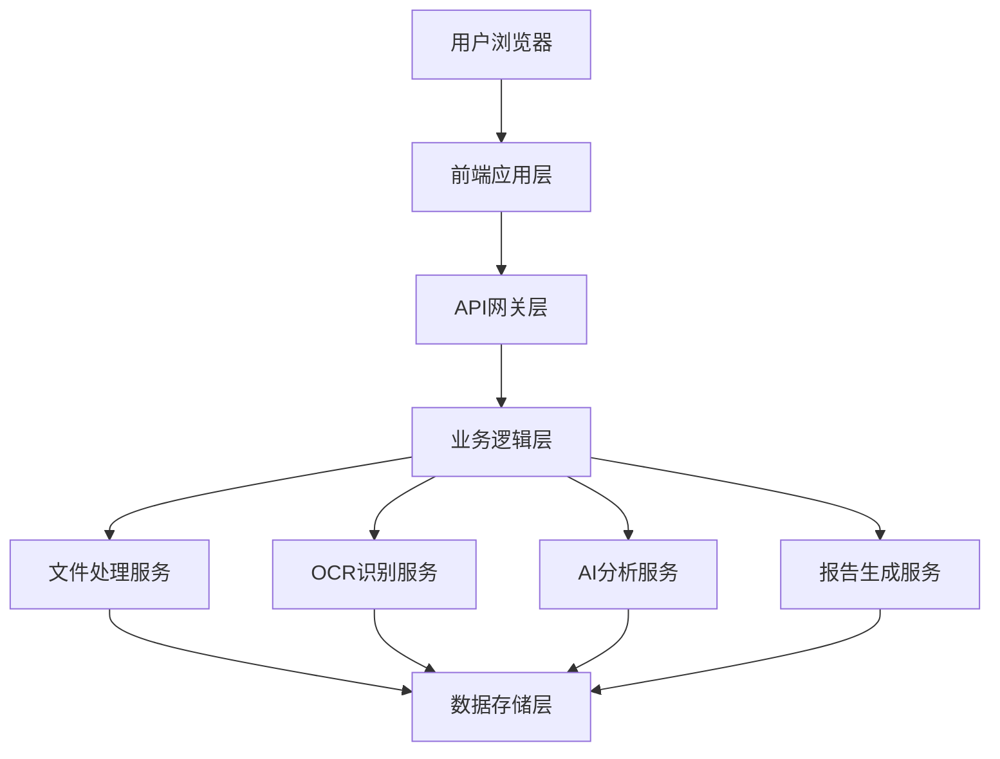

# AIPM 简历分析助手产品需求文档

## 1. 需求背景与目标

### 1.1 行业背景与痛点
随着人工智能技术的快速发展，AI相关岗位（如AI产品经理、AI产品运营、大模型应用产品经理等）的招聘需求激增。然而，在求职过程中，候选人面临以下核心痛点：

1. **简历与岗位匹配度不清晰**：候选人难以准确评估自己的简历与目标岗位JD的匹配程度，无法有针对性地优化简历内容。
2. **简历优化缺乏专业指导**：缺乏专业的简历优化建议，不知道如何突出与AI岗位相关的核心能力和经验。
3. **面试准备不充分**：不了解目标岗位可能的面试问题和考察重点，缺乏系统性的面试准备。
4. **职业发展路径模糊**：对于AI领域的职业发展路径缺乏清晰规划，不知道如何提升自己的竞争力。

同时，招聘方也面临简历筛选效率低下、无法快速识别合适候选人的问题。

### 1.2 项目目标
本项目旨在开发一款基于AI的简历分析智能助手，帮助候选人快速分析简历与目标岗位的匹配度，提供专业的简历优化建议、面试准备指导和职业发展规划，从而提升求职成功率。

#### 短期目标（1-3个月）
- 实现简历与JD的智能匹配分析功能
- 支持多种文件格式的简历和JD上传（TXT、PDF、图片、Word等）
- 生成结构化的分析报告，包含评分、优化建议、面试问题等
- 提供HTML和PDF格式的报告导出功能

#### 长期目标（6-12个月）
- 优化AI分析算法，提升匹配度分析的准确性
- 支持更多AI相关岗位的分析
- 增加简历模板推荐功能
- 实现简历自动生成和优化功能
- 构建AI岗位知识库，提供行业趋势和技能要求分析

## 2. 流程梳理

### 2.1 核心业务流程图

### 2.2 数据流向图

## 3. 用户旅程设计

### 3.1 典型用户角色

**角色名称**：AI产品经理求职者
**用户特征**：
- 具备一定的产品经理经验，希望转型或进阶到AI产品经理岗位
- 对AI技术有一定了解，但缺乏AI产品相关的项目经验
- 不知道如何在简历中突出AI相关的能力和经验
- 希望通过专业指导提升简历质量和面试竞争力

### 3.2 用户旅程地图

| 阶段 | 用户行为 | 用户想法 | 用户感受 | 接触点 | 系统响应 | 机会点 |
|------|---------|---------|---------|-------|---------|--------|
| **发现** | 搜索简历优化工具 | 我需要一个专业的工具来优化我的简历 | 期待、好奇 | 搜索引擎、社交媒体 | - | 优化SEO，增加产品曝光 |
| **了解** | 访问产品官网，查看功能介绍 | 这个工具是否能满足我的需求？ | 评估、怀疑 | 产品官网、功能介绍页 | 展示产品功能和优势 | 提供案例展示，增强信任感 |
| **使用** | 选择目标岗位，输入JD和简历内容 | 希望能得到专业的分析和建议 | 紧张、期待 | 产品主界面、输入表单 | 提供友好的输入界面和引导 | 优化输入体验，支持多种文件格式 |
| **分析** | 等待系统分析结果 | 分析结果会是什么样的？ | 焦虑、期待 | 分析加载页面 | 实时反馈分析进度 | 提供预计等待时间，减少用户焦虑 |
| **获取报告** | 查看分析报告内容 | 这些建议是否实用？ | 惊喜、满意 | 报告展示页面 | 生成结构化、可视化的分析报告 | 提供详细的优化建议和可执行的改进方案 |
| **导出分享** | 导出报告，分享给朋友 | 这个报告很专业，可以分享给需要的人 | 成就感、分享欲 | 报告导出功能 | 支持多种格式导出 | 增加报告分享功能，扩大产品影响力 |
| **改进** | 根据报告优化简历 | 我要按照建议修改简历 | 有方向、有动力 | 简历编辑工具 | - | 整合简历编辑功能，实现一站式服务 |
| **再次使用** | 上传优化后的简历，重新分析 | 看看优化后的效果如何 | 期待、验证 | 产品主界面 | 提供对比分析功能 | 增加简历版本对比功能，展示优化效果 |

## 4. 原型图

### 4.1 产品首页/主界面

**界面布局**：
- 顶部：产品标题和副标题
- 中部：
  - 目标岗位选择下拉框
  - JD输入区域（支持粘贴文本或上传文件）
  - 简历输入区域（支持粘贴文本或上传文件）
  - 开始分析按钮
- 底部：加载状态提示

**交互设计**：
- 支持拖拽上传文件
- 输入区域有引导文字提示
- 开始分析按钮在表单填写完整前为禁用状态
- 分析过程中显示加载动画

### 4.2 分析报告页面

**界面布局**：
- 顶部：报告标题、目标岗位、生成时间
- 中部：
  - 评分与分析理由板块
  - 对照JD逐条修改简历板块
  - 面试可能问的问题板块
  - 职业发展路径板块
  - 结语建议板块
- 底部：报告导出按钮

**交互设计**：
- 每个板块可折叠/展开
- 支持快速跳转到不同板块
- 导出按钮提供HTML和PDF格式选择
- 鼠标悬停在表格行时高亮显示

### 4.3 报告导出流程

**界面流程**：
1. 用户点击导出按钮
2. 系统弹出导出格式选择对话框
3. 用户选择HTML或PDF格式
4. 系统生成并下载报告文件
5. 下载完成后显示成功提示

## 5. 产品功能框架

## 6. 详细功能点

### 6.1 用户输入模块

#### 6.1.1 目标岗位选择
- **功能描述**：用户从预设的AI相关岗位列表中选择目标岗位
- **触发条件**：用户访问系统后，在主界面选择目标岗位
- **输入要求**：从下拉菜单中选择，支持的岗位包括：AI产品经理、AI产品运营、AI解决方案、大模型应用产品经理、AI训练师
- **输出结果**：系统记录用户选择的目标岗位，用于后续分析

#### 6.1.2 JD内容输入
- **功能描述**：用户可以通过粘贴文本或上传文件的方式输入目标岗位的JD内容
- **触发条件**：用户选择JD输入方式后
- **输入要求**：
  - 文本输入：支持多行文本，无字数限制
  - 文件上传：支持TXT、MD、PDF、PNG、JPEG、JPG、DOCX、DOC格式
- **输出结果**：系统获取JD内容，用于后续分析

#### 6.1.3 简历内容输入
- **功能描述**：用户可以通过粘贴文本或上传文件的方式输入自己的简历内容
- **触发条件**：用户选择简历输入方式后
- **输入要求**：
  - 文本输入：支持多行文本，无字数限制
  - 文件上传：支持TXT、MD、PDF、PNG、JPEG、JPG、DOCX、DOC格式
- **输出结果**：系统获取简历内容，用于后续分析

### 6.2 文件处理模块

#### 6.2.1 文本提取
- **功能描述**：从用户上传的文件中提取文本内容
- **触发条件**：用户上传文件后
- **输入要求**：支持TXT、MD、PDF、DOCX、DOC格式的文件
- **输出结果**：提取的纯文本内容

#### 6.2.2 OCR识别
- **功能描述**：对图片或PDF扫描件进行光学字符识别
- **触发条件**：当用户上传的文件为图片或无法直接提取文本的PDF时
- **输入要求**：支持PNG、JPEG、JPG格式的图片和PDF扫描件
- **输出结果**：识别后的文本内容
- **技术实现**：使用pytesseract和easyocr作为OCR引擎，支持中英文识别

#### 6.2.3 文件格式转换
- **功能描述**：将不支持的文件格式转换为可处理的格式
- **触发条件**：当用户上传的文件格式需要转换时（如DOC转DOCX）
- **输入要求**：支持DOC格式的文件
- **输出结果**：转换后的文件内容

### 6.3 AI分析模块

#### 6.3.1 匹配度分析
- **功能描述**：分析简历与JD的匹配程度，给出综合评分和维度拆解分析
- **触发条件**：系统获取到完整的JD和简历内容后
- **输入要求**：JD文本、简历文本、目标岗位
- **输出结果**：
  - 整体评分（0-10分）
  - 综合评价（150字左右）
  - 维度拆解分析（表格形式，包含岗位匹配度、工作经验相关性、技能掌握程度、教育背景契合度、软技能与岗位适配性）
  - 主要差距总结（3-5条核心不匹配点）

#### 6.3.2 简历优化建议
- **功能描述**：对照JD要求，给出简历的具体修改建议
- **触发条件**：匹配度分析完成后
- **输入要求**：JD文本、简历文本
- **输出结果**：表格形式的修改建议，包含简历现有内容、岗位JD要求、差异分析、修改建议

#### 6.3.3 面试问题生成
- **功能描述**：基于简历和JD内容，生成针对性的面试问题
- **触发条件**：简历优化建议生成完成后
- **输入要求**：JD文本、简历文本、目标岗位
- **输出结果**：8-10个高针对性问题，每个问题后标注考察点

#### 6.3.4 职业发展规划
- **功能描述**：根据目标岗位和用户背景，给出职业发展路径建议
- **触发条件**：面试问题生成完成后
- **输入要求**：简历文本、目标岗位
- **输出结果**：分短期（1-3年）、中期（3-5年）、长期（5年以上）三个阶段的职业发展规划，每个阶段包含目标职位、核心任务/能力升级重点、行动建议

### 6.4 报告生成模块

#### 6.4.1 报告模板渲染
- **功能描述**：将AI分析结果渲染为结构化的HTML报告
- **触发条件**：AI分析完成后
- **输入要求**：AI分析结果、目标岗位
- **输出结果**：HTML格式的分析报告

#### 6.4.2 数据可视化
- **功能描述**：将分析数据以可视化的方式展示
- **触发条件**：报告模板渲染过程中
- **输入要求**：分析结果数据
- **输出结果**：包含评分图表、匹配度雷达图等可视化元素的报告

### 6.5 报告导出模块

#### 6.5.1 HTML报告导出
- **功能描述**：将分析报告导出为HTML格式
- **触发条件**：用户选择HTML格式导出
- **输入要求**：HTML格式的分析报告
- **输出结果**：可下载的HTML文件

#### 6.5.2 PDF报告导出
- **功能描述**：将分析报告导出为PDF格式
- **触发条件**：用户选择PDF格式导出
- **输入要求**：HTML格式的分析报告
- **输出结果**：可下载的PDF文件
- **技术实现**：使用浏览器打印功能生成PDF

## 7. 专业术语

| 术语 | 定义 |
|------|------|
| JD | Job Description的缩写，即职位描述，包含岗位职责、任职要求等信息 |
| OCR | Optical Character Recognition的缩写，即光学字符识别，用于将图片或扫描件中的文字转换为可编辑的文本 |
| AI | Artificial Intelligence的缩写，即人工智能，指模拟人类智能的计算机系统 |
| 大模型 | 指参数量巨大的人工智能模型，如GPT、文心一言、通义千问等 |
| 匹配度 | 简历与目标岗位JD的契合程度，通常用分数表示 |
| 维度拆解 | 将整体评分拆分为多个维度进行分析，如工作经验、技能、教育背景等 |
| 雷达图 | 一种多变量数据可视化图表，用于展示多个维度的数据对比 |
| HTML | HyperText Markup Language的缩写，即超文本标记语言，用于创建网页 |
| PDF | Portable Document Format的缩写，即可移植文档格式，用于跨平台展示文档 |
| 前端 | 指用户直接交互的界面部分，如网页、移动应用等 |
| 后端 | 指系统的服务器端部分，负责数据处理、业务逻辑等 |
| API | Application Programming Interface的缩写，即应用程序编程接口，用于不同软件系统之间的通信 |
| 模型 | 指人工智能算法的具体实现，如用于自然语言处理的语言模型 |

## 8. 附录

### 8.1 技术栈
- 前端：HTML5、CSS3、JavaScript
- 后端：Python、Flask
- AI模型：通义千问（qwen-plus）
- OCR引擎：pytesseract、easyocr
- 文件处理：pdfplumber、python-docx
- 报告生成：markdown、HTML模板

### 8.2 系统架构

### 8.3 性能要求
- 文件上传大小限制：单个文件不超过50MB
- OCR识别时间：单张图片不超过10秒
- AI分析时间：不超过30秒
- 报告生成时间：不超过5秒
- 系统响应时间：页面加载时间不超过2秒

### 8.4 安全要求
- 用户数据加密传输
- API密钥安全存储（环境变量配置）
- 用户上传文件的安全扫描
- 防止SQL注入、XSS攻击等常见安全漏洞
- 定期备份用户数据

---

**文档版本**：V1.0
**撰写日期**：2026-01-19
**撰写人**：AI产品经理
**审核人**：技术负责人
